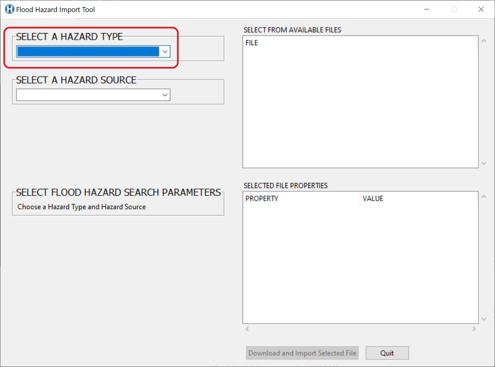
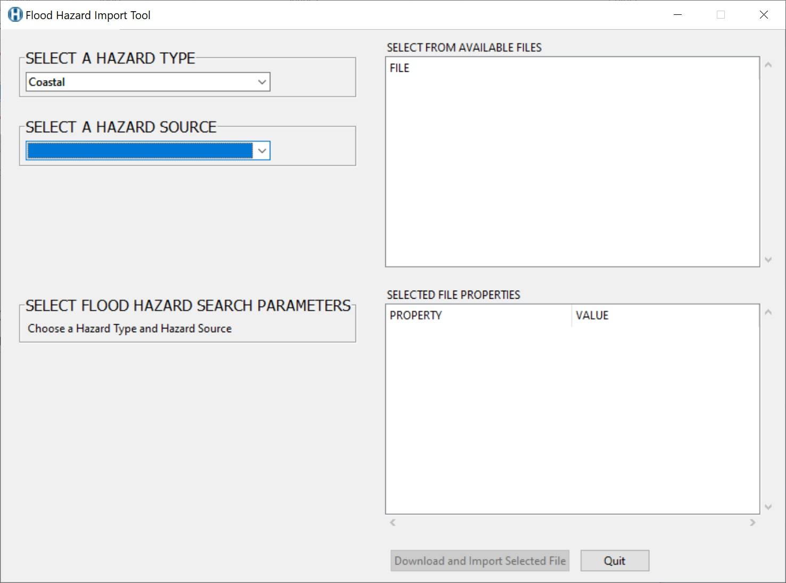
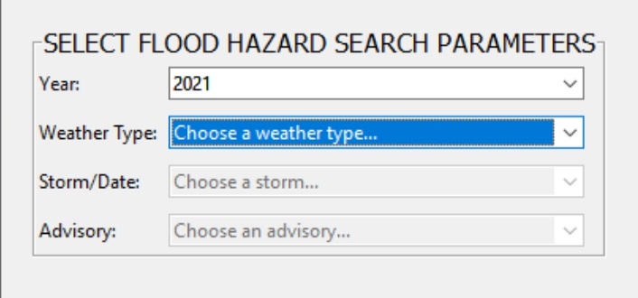
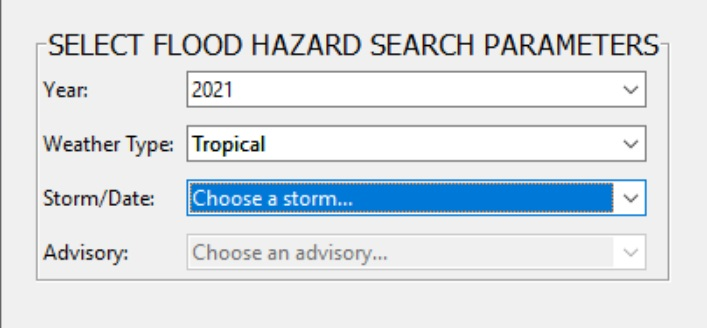
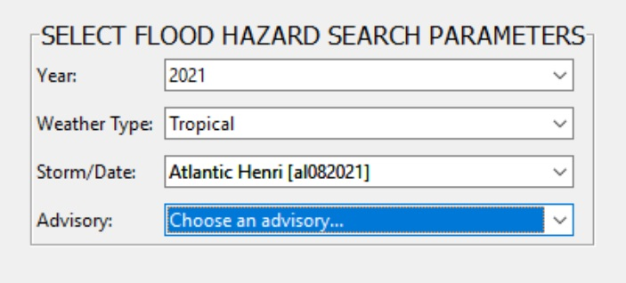
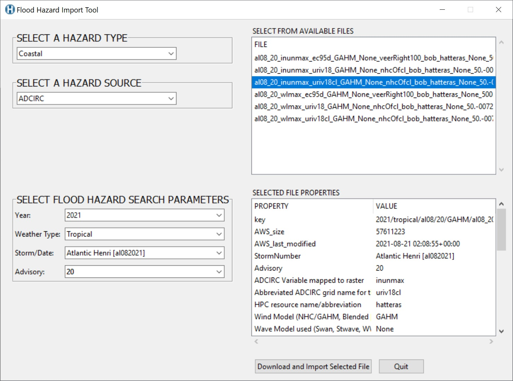
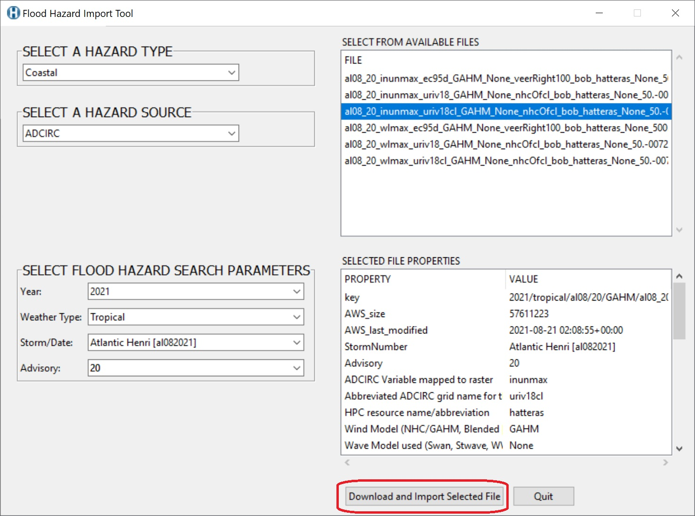
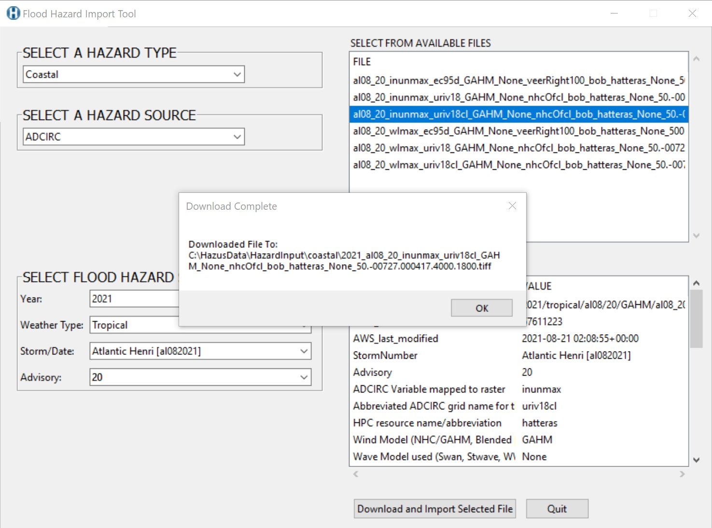

# Flood Hazard Import Tool (FHIT)

The Flood Hazard Import Tool FHIT is used to download depth grids for use in Hazus modelling of Coastal, Riverine and Storm Surge flooding.

## Requirements

The Flood Hazard Import Tool requires Hazus, Conda, and an internet connection. If you haven't already, follow this [README](https://github.com/nhrap-dev/Environment-Setup/tree/update-README) to setup your machine with miniforge and conda before trying to run FHIT.

## To Use

1. Download zip folder of tool from GitHub, unzip.

  

2. Double click the FHIT.py to run it. It will check if you have the latest hazpy and tool version. 

  

3. Select your hazard type (Coastal, Riverine, Storm Surge)

  

4. Select your data source. The subsequent search parameters will differ depending on the data source.

  

ADCIRC:

  1. Select your year
    
  
    
  2. Select your weather type (Tropical, Synoptic)
    
  
    
  3. Select your storm
    
  
    
  4. Select your storm advisory 
    
  
  
 
5. Select Depth Grid File

  
 
You will see the selected files properties once you've selected a file

  

6. Download and import your selected depth grid file. This will create a 'Coastal', 'Riverine' or 'Surge' folder in your HazardInput folder and download the selected depth grid into it.

  

  

## Documentation

See the files in the Docs folder for additional information. 

This tool currently only supports ADCIRC depth grids.

   

**2021-Synoptic-20210609-18z**  = YYYYMMDD, 18 hour zulu

**2021-Tropical-al19-30** = 19th storm in the Atlantic in 2021, advisory 30

Advisory **00** is the hindcast data

## Contact

Issues can be reported through the repository on Github (https://github.com/nhrap-dev/FHIT)

For questions contact fema-hazus-support@fema.dhs.gov
